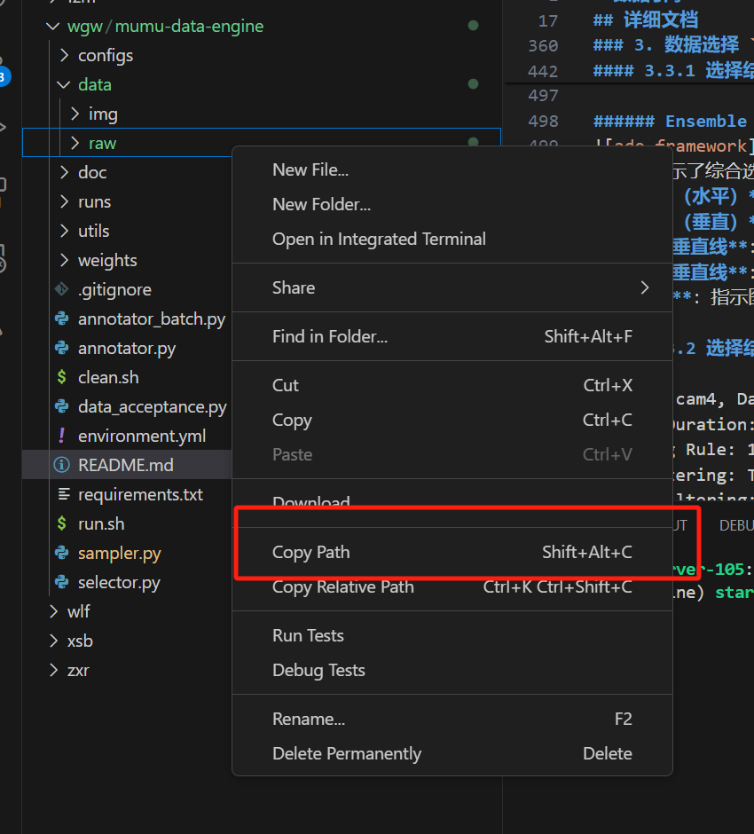

# 服务器连接和图片上传下载
### 链接为示例图片可进网页观看
>原理:
在电脑上运行可在远程服务器上工作的软件，远程控制软件，借助服务器的算力去进行工作。
----
>所以核心需要解决的问题是：
1. 本地电脑连接远程服务器。
2. 连接服务器后上传待处理文件，下载处理好的文件。
----
>电脑环境配置
1. 建议下载vscode软件，可在其中配置各种插件，比较方便。下以VScode为例，讲解会使用到的插件内容等。
（在百度上搜索vscode，根据自己电脑配置选择版本下载安装）

2. 下载vscode后，点击插件选项，搜索python，remote explorer两个插件，下载安装。
    （remote explorer是远程连接插件）（软件左列中  为插件选项）
3. 用vscode打开解压缩的文件。    

## 服务器的连接：
1. 新人，需要配置本地公钥（在本地电脑中创造可进入本地电脑的钥匙，复制后存在服务器中，在连接时可进行识别）
* 打开命令提示符（Windows电脑按住win+r，输入cmd）
* 在>后输入ssh-keygen回车，会让选择存储的位置，可更改，更改后回车生成。
* 在之前设置的文件夹内找到id_rsa.pub文件，用txt或者doc，均可打开，复制其中内容，发送给录入人员（复制的代码就是本地电脑的公钥内容）
2. 录入人员，需要把公钥存入服务器中
* 点击进入remote explorer插件（图标为电脑图样）
* 连入服务器

* 在进入的界面键入cd ~/.ssh/(进入ssh文件)

* 键入code authorized_keys(打开输入公钥的界面)在打开的界面粘入新人的公钥，即配置成功。

## 文件的上传和下载
>原理：本地文件需要上传到服务器中进行操作处理，处理后再下载回本地文档。
1. 若只有单一视频可直接拖拽到文件内（慢）

2. 若多文件可打包直接用代码上传到服务器指定路径中。
（键入指令`sep -r 文件所在目标 star@sever-105`）(star@sever-105为服务器位置)
（解压指令`unzip example.zip`）
3. 下载处理后图片，可圈选指定图片右键下载（慢）
4. 多文件可同样用指令，调换位置即可。
（键入指令`sep -r star@sever-105 文件所在目标`）(star@sever-105为服务器位置)

